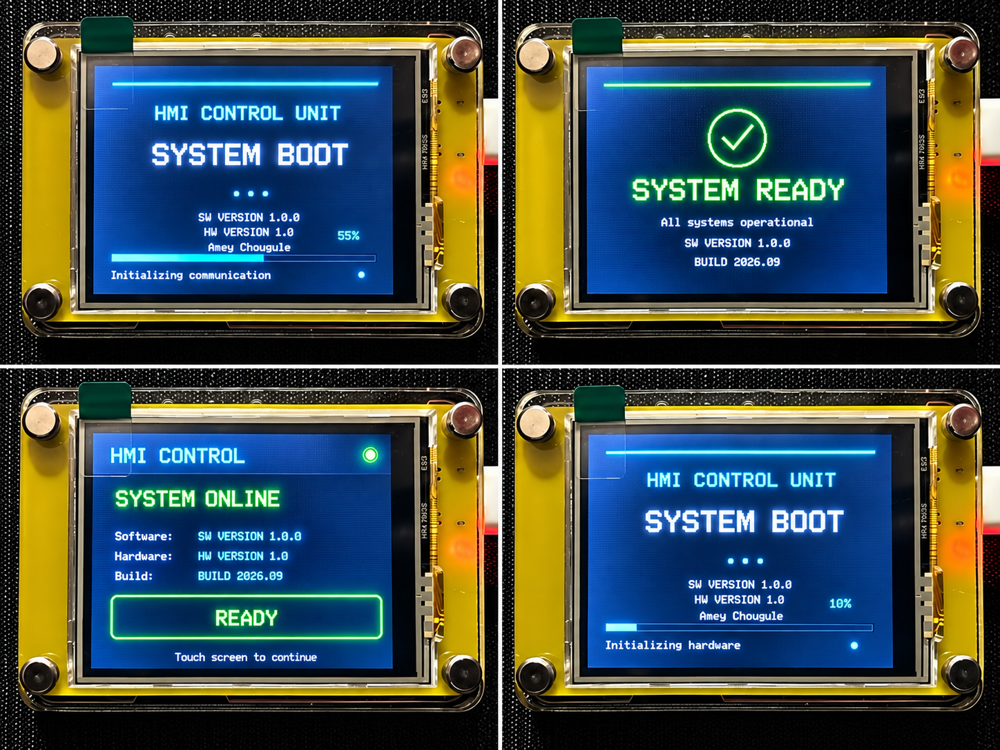

# HMI Control Unit – Boot Animation

This example demonstrates a basic **HMI Control Unit interface** for the Elecrow CrowPanel 2.4-inch ESP32 HMI.

The application provides a startup sequence with system information, initialization progress, system diagnostics, and a final **System Ready** screen before displaying the main HMI interface.

## Overview

The example demonstrates:

- TFT display initialization
- Touchscreen initialization
- Backlight control
- SPI communication
- HMI boot animation
- System initialization sequence
- Progress bar
- Animated loading indicators
- System-ready indication
- Software and hardware version display
- Build information
- Main HMI status screen
- Basic embedded HMI UI design

## Output

The example displays a complete HMI boot sequence, including the system boot screen, initialization progress, system-ready screen, and the final HMI control interface.



The image above shows the different stages of the system boot and HMI initialization sequence.

## Hardware

- Elecrow CrowPanel 2.4-inch ESP32 HMI
- ESP32-WROOM-32
- 2.4-inch 320×240 ILI9341 TFT Display
- XPT2046 resistive touchscreen

## TFT Configuration

| Function | GPIO |
|---|---:|
| TFT CS | GPIO 15 |
| TFT DC | GPIO 2 |
| TFT SCLK | GPIO 14 |
| TFT MOSI | GPIO 13 |
| TFT MISO | GPIO 4 |
| TFT Backlight | GPIO 27 |
| TFT Reset | ESP32 EN / RESET |

## Touch Configuration

| Function | GPIO |
|---|---:|
| Touch CS | GPIO 33 |
| Touch IRQ | GPIO 36 |

## Required Libraries

- Adafruit GFX Library
- Adafruit ILI9341
- XPT2046_Touchscreen
- SPI

## System Information

The HMI displays configurable system information during the boot sequence and on the main screen.

| Parameter | Default Value |
|---|---|
| Product Name | HMI CONTROL UNIT |
| Software Version | SW VERSION 1.0.0 |
| Hardware Version | HW VERSION 1.0 |
| Build Date | BUILD 2026.09 |
| Company Name | Amey Chougule |

These values can be modified in the source code according to the target application.

## Boot Sequence

When the system starts, the HMI displays a boot screen containing:

1. Product name
2. System boot message
3. Loading indicator
4. Software version
5. Hardware version
6. Company name
7. Initialization progress
8. Progress percentage
9. System diagnostics
10. System-ready indication

The initialization sequence includes:

```text
Initializing hardware
Initializing display
Initializing touch
Initializing communication
Loading system configuration
Running diagnostics
Starting application
