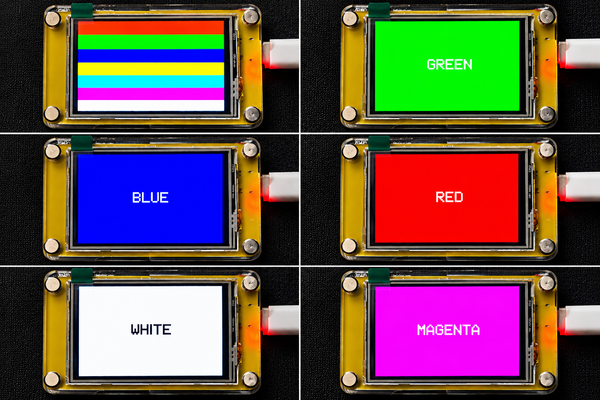

# TFT Color Test Example

This example demonstrates a **TFT display color test** for the Elecrow CrowPanel 2.4-inch ESP32 HMI.

The program displays different colors sequentially on the ILI9341 TFT display, shows the corresponding color name, and finally displays a full-screen color bar pattern.

## Overview

The example tests:

- Basic display initialization
- TFT backlight control
- SPI communication
- Basic RGB colors
- Secondary colors
- 16-bit RGB565 color values
- Gray color
- Full-screen color bars

The display continuously cycles through the color tests.

## Hardware

- Elecrow CrowPanel 2.4-inch ESP32 HMI
- ESP32-WROOM-32
- 2.4-inch 320×240 ILI9341 TFT Display

## Display Configuration

| Function | GPIO |
|---|---:|
| TFT CS | GPIO 15 |
| TFT DC | GPIO 2 |
| TFT SCLK | GPIO 14 |
| TFT MOSI | GPIO 13 |
| TFT Backlight | GPIO 27 |
| TFT Reset | ESP32 EN / RESET |

## Required Libraries

- Adafruit GFX Library
- Adafruit ILI9341
- SPI

## Test Sequence

The example displays the following colors sequentially:

### Basic Colors

- BLACK
- WHITE
- RED
- GREEN
- BLUE

### Secondary Colors

- YELLOW
- CYAN
- MAGENTA

### RGB565 Color Values

The example also tests colors using hexadecimal RGB565 values:

- `0xF800` – RED
- `0x07E0` – GREEN
- `0x001F` – BLUE
- `0xFFE0` – YELLOW
- `0x07FF` – CYAN
- `0xF81F` – MAGENTA
- `0x8410` – GRAY

### Color Bars

At the end of the sequence, the display shows eight full-height color bars:

**RED | GREEN | BLUE | YELLOW | CYAN | MAGENTA | WHITE | BLACK**

The color-bar test runs for approximately 3 seconds before the complete sequence starts again.

## Output



The display should show each color as a full-screen background with its corresponding name in a contrasting text color.

## Serial Monitor

The program initializes the serial interface at:

```text
115200 baud