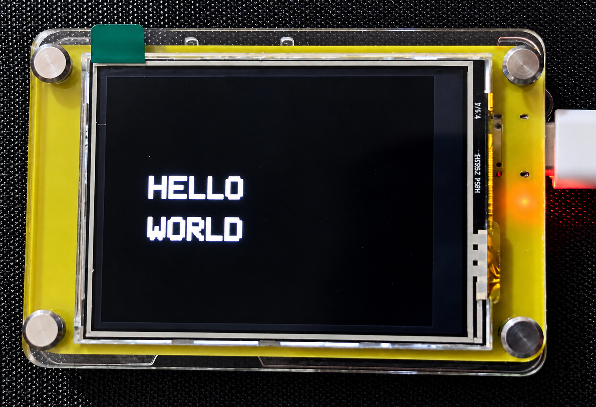

# Hello World – TFT Display

This example demonstrates a basic **HELLO WORLD** display on the Elecrow CrowPanel 2.4-inch ESP32 HMI using the ILI9341 TFT display.

## Overview

The example initializes the TFT display, enables the display backlight, and displays:

**HELLO**  
**WORLD**

in landscape orientation.

## Hardware

- Elecrow CrowPanel 2.4-inch ESP32 HMI
- ESP32-WROOM-32
- 2.4-inch 320×240 ILI9341 TFT Display

## Display Configuration

| Function | GPIO |
|---|---:|
| TFT CS | GPIO 15 |
| TFT DC | GPIO 2 |
| TFT SCLK | GPIO 14 |
| TFT MOSI | GPIO 13 |
| TFT Backlight | GPIO 27 |
| TFT Reset | ESP32 EN / Reset |

## Required Libraries

- Adafruit GFX Library
- Adafruit ILI9341
- SPI

## Output



The display should show **HELLO WORLD** on a black background in landscape orientation.

## Example Purpose

This is a basic display test intended to verify:

- TFT display initialization
- SPI communication
- Display backlight control
- ILI9341 display functionality
- Basic text rendering

## Project Structure

```text
Hello_World/
├── README.md
├── Hello_World.ino
└── hello_world.png