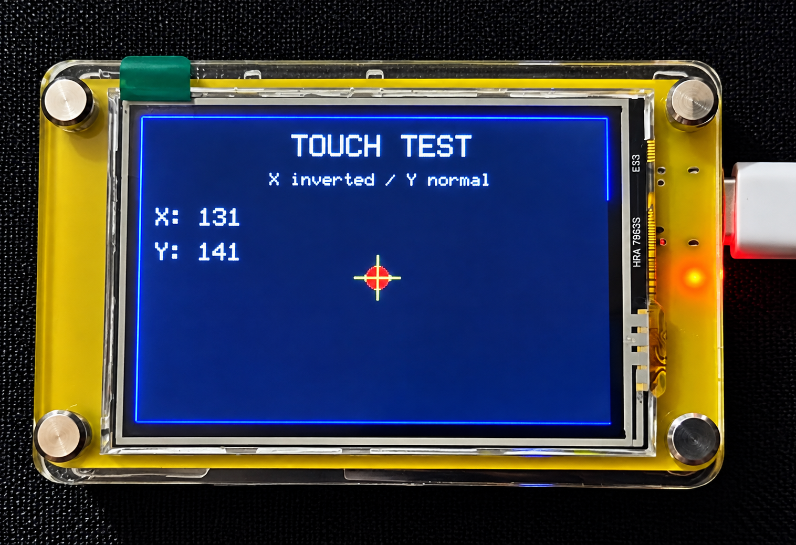

# Touch Test Example

This example demonstrates the **resistive touchscreen functionality** of the Elecrow CrowPanel 2.4-inch ESP32 HMI.

The program detects touch input, converts the raw touchscreen coordinates into screen coordinates, and displays the touch position on the TFT display.

## Overview

The example demonstrates:

- Touchscreen initialization
- Touch coordinate reading
- Raw-to-screen coordinate mapping
- X-axis inversion
- Y-axis normal mapping
- Touch point visualization
- Crosshair display
- Touch coordinate display
- Serial Monitor coordinate output

## Hardware

- Elecrow CrowPanel 2.4-inch ESP32 HMI
- ESP32-WROOM-32
- 2.4-inch 320×240 ILI9341 TFT Display
- XPT2046 resistive touchscreen controller

## TFT Configuration

| Function | GPIO |
|---|---:|
| TFT CS | GPIO 15 |
| TFT DC | GPIO 2 |
| TFT SCLK | GPIO 14 |
| TFT MOSI | GPIO 13 |
| TFT MISO | GPIO 4 |
| TFT Backlight | GPIO 27 |
| TFT Reset | ESP32 EN / RESET |

## Touch Configuration

| Function | GPIO |
|---|---:|
| Touch CS | GPIO 33 |
| Touch IRQ | GPIO 36 |
| Touch SCLK | GPIO 14 |
| Touch MOSI | GPIO 13 |
| Touch MISO | GPIO 4 |

The touchscreen uses the SPI interface for communication.

## Touch Calibration

The example uses the following raw touchscreen calibration values:

| Parameter | Value |
|---|---:|
| TS_MIN_X | 200 |
| TS_MAX_X | 3900 |
| TS_MIN_Y | 200 |
| TS_MAX_Y | 3900 |

The **X-axis is inverted**, while the **Y-axis is mapped normally**.

## Required Libraries

- Adafruit GFX Library
- Adafruit ILI9341
- XPT2046_Touchscreen
- SPI

## Display

When the program starts, the display shows a **TOUCH TEST** header with a blue border.

When the screen is touched:

- A red circle is drawn at the detected position.
- A yellow crosshair marks the touch location.
- The calculated X and Y coordinates are displayed on the screen.



## Serial Monitor

The Serial Monitor operates at:

```text
115200 baud