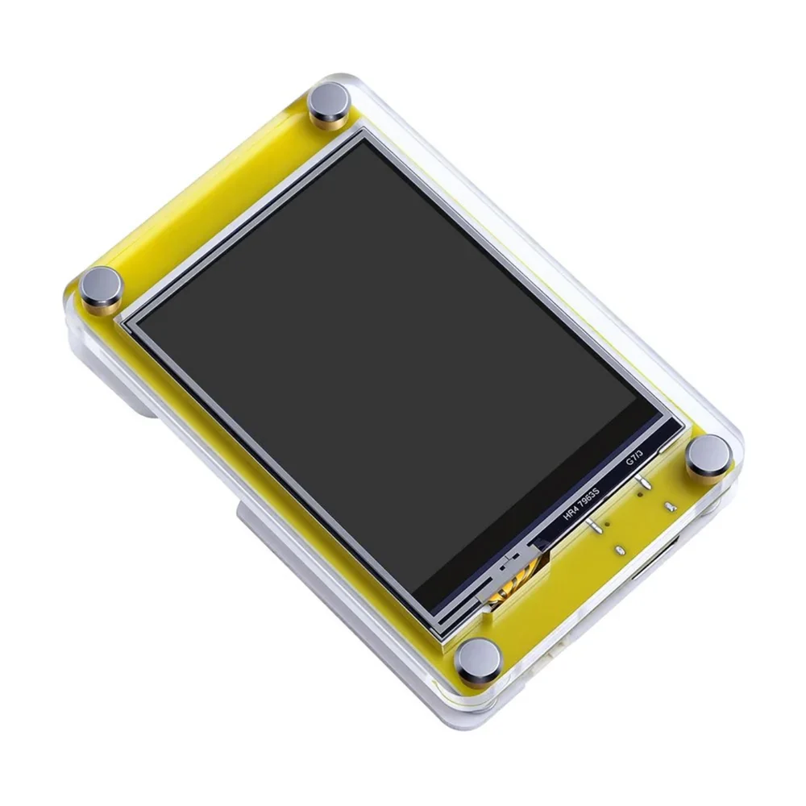
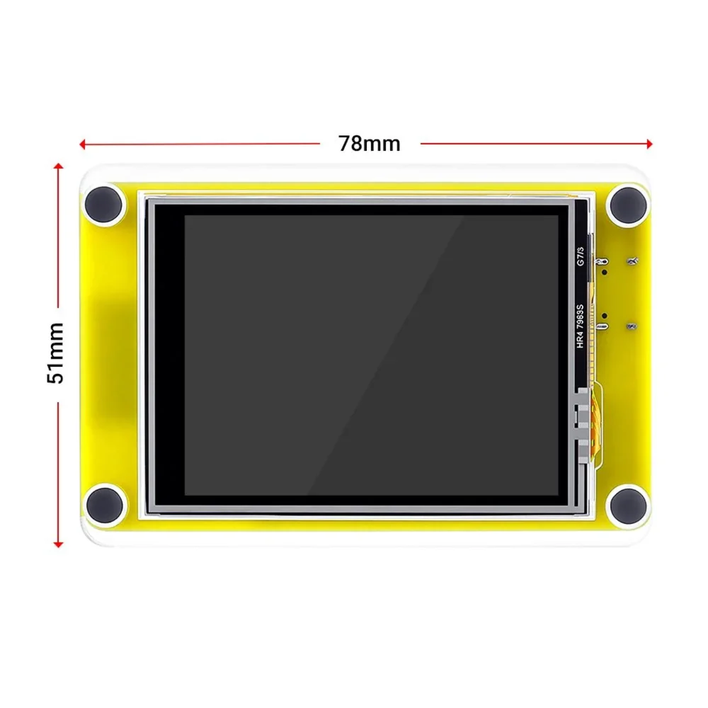
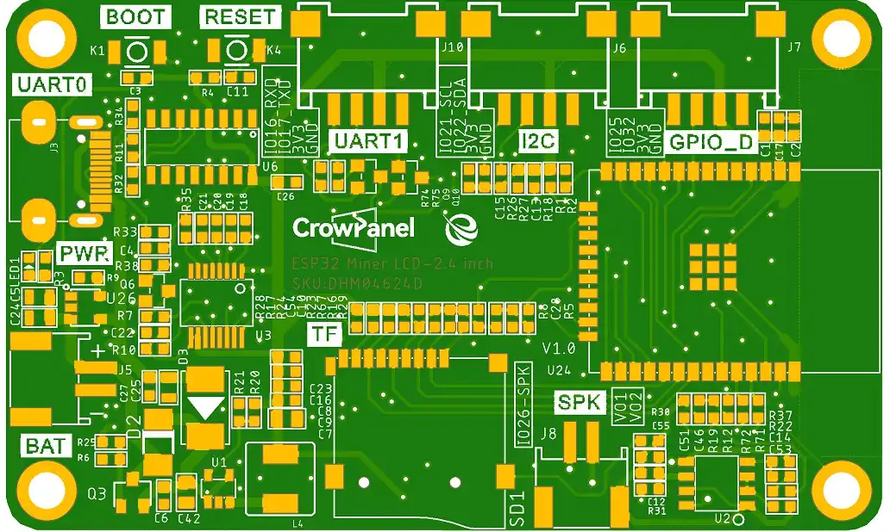
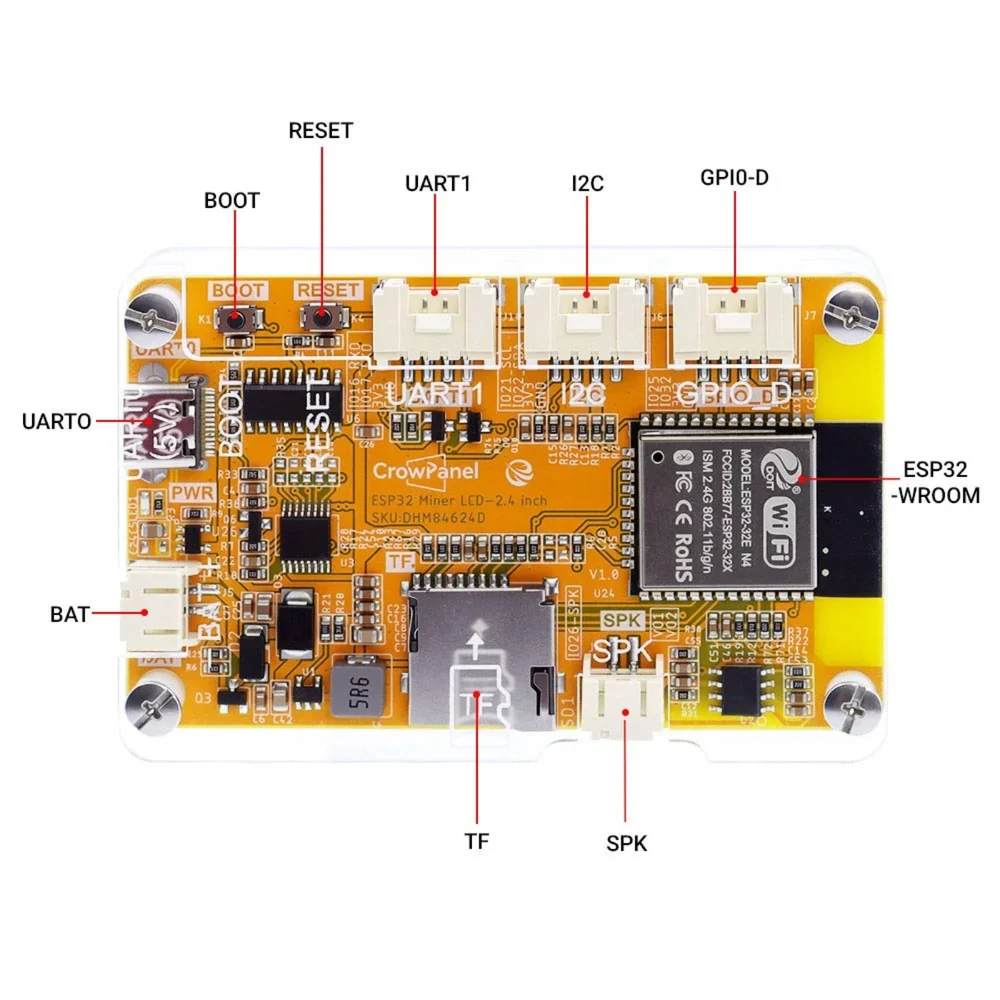

# Images

This directory contains hardware reference images and visual documentation for the **CrowPanel 2.4-inch ESP32 HMI**.

The images are used throughout the repository for hardware identification, mechanical reference, PCB documentation, and interface documentation.

---

## Hardware Reference Images

### FR01 — Front View



**File:** `FR01.jpg`

Front view of the CrowPanel 2.4-inch ESP32 HMI showing the 2.4-inch TFT touchscreen and overall module assembly.

---

### FR02 — Mechanical Dimensions



**File:** `FR02.jpg`

Front view showing the overall mechanical dimensions of the module.

**Approximate dimensions:**

- Width: **78 mm**
- Height: **51 mm**

---

### PB01 — PCB Reference



**File:** `PB01.jpg`

PCB reference image showing the board layout, component placement, mounting holes, connectors, and major hardware sections.

---

### RR01 — Rear / Interface View



**File:** `RR01.JPG`

Rear/component view showing the major hardware interfaces and connectors available on the module.

Interfaces shown include:

- UART0
- UART1
- I²C
- GPIO-D
- BAT
- SPK
- TF / microSD
- BOOT
- RESET
- USB / USB-C
- ESP32-WROOM module

---

## Image Reference Table

| File | Reference | Description |
|---|---|---|
| `FR01.jpg` | Front Reference 01 | Front view of the HMI module |
| `FR02.jpg` | Front Reference 02 | Front view with mechanical dimensions |
| `PB01.jpg` | PCB Reference 01 | PCB layout and component placement |
| `RR01.JPG` | Rear Reference 01 | Rear view with connectors and interfaces |

---

## Naming Convention

The hardware reference images follow a simple naming convention:

```text
FR → Front Reference
RR → Rear Reference
PB → PCB Reference
